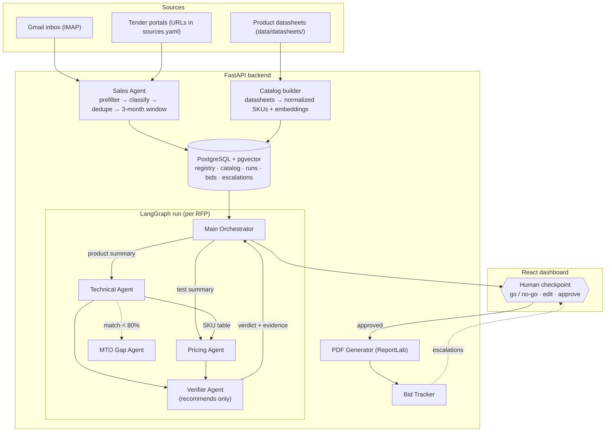

# BidPilot 🏗️⚡

**Agentic tender-response automation** — a multi-agent pipeline that reads real tender emails and portal listings, matches requirements against a product catalog with an auditable Spec Match %, prices the bid, and generates a submission-ready PDF. A verifier agent re-checks everything and recommends bid/no-bid — but **no agent ever takes a decision; humans decide at an approval checkpoint**. After submission, a persistent tracker watches deadlines and replies, drafts follow-ups, and escalates to a human whenever an agent fails or is unsure.

[**Live Demo**](https://your-demo-link.vercel.app/) · [**GitHub**](https://github.com/alisham30/BidPilot)

`Python` `FastAPI` `LangGraph` `Claude API` `PostgreSQL` `ReportLab` `React`

---

## ⚠️ Engineering ground rules (read before writing any code)

These are non-negotiable properties of the system. A build that violates any of them is wrong, even if the demo looks fine.

1. **No hardcoded data anywhere in application code.** No sample RFPs, no inline SKU lists, no dummy prices, no per-site HTML parsers, no hardcoded email senders/subjects. All sources, keywords, categories, thresholds, and URLs live in `config/sources.yaml`. All credentials live in `.env`. Product data enters only through the datasheet ingestion path; RFPs enter only through the email/web scanners. Test fixtures live in `tests/fixtures/` and are imported nowhere outside tests.
2. **Deterministic where auditable, LLM where linguistic.** Claude is used ONLY to: read/classify documents, extract structured data against JSON schemas, write summaries, and draft prose. Every number a customer could audit — Spec Match %, unit prices, totals — is computed by plain Python from extracted data. If an LLM ever emits a price or a match percentage that gets used, that is a bug.
3. **Agents recommend, humans decide.** No code path may submit a bid, cancel a bid, drop a line item, or send an email without an explicit human action recorded through the API. The verifier outputs a recommendation with evidence — never an action.
4. **Structured LLM output only.** Every Claude call goes through one shared module using forced tool-use with a JSON Schema, validated by Pydantic, with retry-on-invalid. No free-text parsing of LLM responses anywhere.
5. **Fail loudly, escalate cleanly.** Any agent exception or low-confidence result creates an `escalation` row and surfaces in the dashboard. Silent failure or silent fallback to fake data is forbidden.
6. **Everything replayable.** Every pipeline run snapshots its full state (summaries, tables, verdicts, prices) to Postgres so any bid can be reconstructed later.

---

## Why this exists

Manual B2B RFP response at a growing OEM (reference domain: wires & cables supplying LSTK/PSU infrastructure tenders) breaks predictably: tenders are discovered late, technical SKU matching is slow and expertise-bound, pricing waits on technical, and nothing tracks a bid after submission. Historical analysis showed **90% of wins correlated with timely-actioned RFPs** and **60% with adequate technical matching time**. BidPilot attacks exactly those bottlenecks — without ever taking authority away from the humans who own the bid.

## Features

- 📬 **Live tender ingestion** — scans a Gmail inbox (IMAP) and any configured tender-portal URL. A cheap keyword prefilter runs before any LLM spend; Claude then classifies and extracts listings against a strict schema. **No per-site parsers** — adding a portal is one line of YAML.
- 🎯 **Deterministic spec matching** — Claude extracts RFP specs into a normalized schema; a pure-Python scorer computes **Spec Match %** (equal weightage per parameter, partial credit for numeric closeness, meets-or-exceeds handling). Top-3 SKUs per line item with a per-parameter comparison table. Every percentage is reproducible.
- 🛡️ **Verifier agent** — independently re-derives every match from the tender spec + SKU datasheet and asserts pricing rules. Unfulfillable items are **flagged as gaps, never forced into a match** — trap tenders with impossible specs get caught here. Output is a recommendation (proceed / proceed-with-deviations / recommend no-bid) with evidence. **It has no authority to act.**
- 💰 **Parallel pricing** — test/acceptance costs priced immediately while matching runs; material pricing joins when SKUs arrive. All arithmetic in code.
- 📄 **Submission-ready PDF** — cover, SKU tables, price schedule, clause-level deviation statement (ReportLab) — generated only after human approval.
- ⏰ **Persistent bid tracking** — monitors deadlines and post-submission replies, drafts follow-up emails (**never auto-sends**), and escalates to a human on approaching deadlines, ambiguous replies, agent errors, or low confidence.

## Architecture



## Agent contracts (precise I/O — implement exactly)

### Main Orchestrator
- **In:** `rfp_id` (registry row + normalized RFP JSON).
- **Does:** builds two role-contextual summaries (products → Technical; tests/acceptance → Pricing); dispatches both branches in parallel (LangGraph fan-out); joins results; consolidates the draft response; owns retries/timeouts and the run log.
- **Out:** `DraftResponse {sku_table, price_table, mto_requests, verifier_verdict, run_log}` → posted to the human checkpoint. Never proceeds past the checkpoint on its own.

### Sales Agent
- **In:** nothing (scheduler-triggered) or a manual trigger.
- **Does:** IMAP scan (keyword prefilter → Claude classify → save attachments) + portal scan (fetch page → visible text + labeled links → Claude listing extraction). Dedupes into the registry (stable id = ref no, else sha1 of title|due|issuer). Applies the due-within-92-days window via date math at query time.
- **Out:** new registry rows with status `new`.

### Technical Agent
- **In:** product summary + normalized line items.
- **Does per line item:** pgvector shortlist (~10 candidate SKUs) → deterministic `spec_match()` for each candidate → rank → keep top 3 → build the comparison table (rows = spec parameters; columns = RFP requirement, SKU-1, SKU-2, SKU-3 values + per-parameter score) → select top pick. If best score < `matching.mto_threshold` (default 80), emit the item to the MTO Gap Agent.
- **Out:** `TechTable {item → top3, comparison, top_pick, evidence}` → to Orchestrator, Pricing, and Verifier.

### Pricing Agent
- **In (immediately):** test/acceptance summary. **In (on join):** final SKU table.
- **Does:** maps tests to the services price table; joins SKUs × quantities × material price table; consolidates per-line and grand totals. Missing price-table entries are escalations, not guesses.
- **Out:** `PriceTable {lines[], test_lines[], grand_total}` → to Orchestrator and Verifier.

### Verifier Agent
- **In:** TechTable + PriceTable + original RFP JSON + SKU datasheet records.
- **Does:** *independently* re-derives each match (fresh Claude cross-exam comparing tender spec vs SKU spec — it must not see the Technical Agent's reasoning, only its conclusions) and re-runs the deterministic scorer to confirm percentages; asserts pricing rules (every line priced from a real table row, quantity × rate arithmetic checks, no missing test costs). Items it cannot verify or fulfil are flagged with reasons.
- **Out:** `Verdict {per_item: verified|flagged(reason), overall: proceed|proceed_with_deviations|recommend_no_bid, evidence[]}`. **No side effects. No actions.**

### MTO Gap Agent
- **In:** sub-threshold items with per-parameter deltas from the scorer.
- **Out:** drafted made-to-order engineering request (which parameters fall short, by how much, closest base SKU) → stored, surfaced in dashboard. Human raises it internally.

### Bid Tracker
- **In:** bids with status `submitted`.
- **Does:** scheduled ticks check deadlines; IMAP polling classifies replies referencing the bid; drafts follow-ups. Creates escalations for: deadline within N days, ambiguous reply, any agent error, confidence below threshold.
- **Out:** follow-up drafts (require human send approval) + escalation rows.

## Spec Match % — the exact algorithm

```python
def spec_match(rfp_specs: list[SpecParam], sku_specs: dict[str, str]) -> MatchResult:
    """Equal weightage across all required parameters. Deterministic. Unit-tested."""
    scores, evidence = [], []
    for req in rfp_specs:                       # every required param counts equally
        actual = normalize(sku_specs.get(req.name))
        if actual is None:
            s = 0.0                             # missing spec = fail, never assume
        elif req.kind == "numeric_exact":       # e.g. cores, cross-section
            s = 1.0 if within_tol(actual, req) else max(0.0, 1 - abs(actual - req.numeric_value) / req.numeric_value)
        elif req.kind == "numeric_min":         # meets-or-exceeds, e.g. temp rating
            s = 1.0 if actual >= req.numeric_value else max(0.0, actual / req.numeric_value)
        else:                                   # categorical, e.g. XLPE, Cu, IS 7098
            s = 1.0 if actual in equivalents(req.value) else 0.0
        scores.append(s)
        evidence.append(Evidence(req.name, req.value, actual, s))
    return MatchResult(pct=round(100 * sum(scores) / len(scores), 1), evidence=evidence)
```

Notes: `equivalents()` reads a small equivalence map from config (e.g. "aluminium" ≡ "Al"), extendable without code changes. Unit normalization (kV vs V, sqmm vs mm²) happens in `normalize()` — covered by unit tests. The comparison table and the deviation statement are both rendered from `evidence`, so they can never disagree with the score.

## Data model (PostgreSQL)

| Table | Key columns |
|---|---|
| `rfps` | rfp_id PK, title, issuer, reference_no, due_date, source, doc_paths[], status (`new→extracted→drafting→awaiting_review→approved/no_bid→submitted→closed`), timestamps |
| `rfp_datasets` | rfp_id FK, line_items JSONB, tests JSONB, extracted_at |
| `skus` | sku_id PK, name, category, specs JSONB, datasheet_source, embedding vector |
| `price_materials` | sku_id FK, unit, unit_price, currency, valid_from |
| `price_services` | test_name, standard, price, currency |
| `runs` | run_id PK, rfp_id FK, state JSONB (full RFPState snapshot), status, started_at, finished_at |
| `decisions` | run_id FK, actor (human user id), action (`approve/edit/no_bid/send_followup`), payload JSONB, decided_at — **every consequential action has a row here** |
| `escalations` | id, rfp_id, source_agent, reason, severity, status (`open/acked/resolved`) |

## API surface (FastAPI)

```
POST /scan/email            trigger inbox scan
POST /scan/web              trigger portal scan
POST /catalog/rebuild       re-ingest datasheets
GET  /rfps?window=3m        registry with due-window filter
POST /rfps/{id}/respond     start a LangGraph run (async; progress via WebSocket /ws/runs/{run_id})
GET  /runs/{id}             full run state incl. tables, verdict, evidence
POST /runs/{id}/decision    human action: approve | edit(payload) | no_bid(reason)   ← the ONLY path to a decision
GET  /runs/{id}/pdf         generated bid PDF (403 until an approve decision exists)
GET  /escalations           open escalations
POST /followups/{id}/send   human-approved follow-up send
```

## Frontend (React + Vite)

Pages: **Pipeline** (RFP registry, statuses, due-window flags, scan triggers) · **Run view** (live progress via WebSocket; comparison tables with per-parameter evidence; verifier verdict side-by-side with technical picks, disagreements highlighted) · **Approval screen** (go / edit / no-bid — this is the human checkpoint; edits re-trigger verification) · **Bids** (submitted bids, tracker status, follow-up drafts awaiting send approval) · **Escalations** (alert feed). Keep the UI thin: all logic server-side; the frontend renders state and posts decisions.

## Project structure

```
BidPilot/
├── backend/
│   ├── app/
│   │   ├── main.py               # FastAPI app + WebSocket
│   │   ├── config.py             # sources.yaml + .env loader (ONLY module touching env)
│   │   ├── schemas.py            # Pydantic models + JSON schemas (the extraction contract)
│   │   ├── llm.py                # single Claude entry point — forced tool-use, retries
│   │   ├── ingestion/            # email_scanner.py · web_scanner.py · docparse.py
│   │   ├── dataset/              # registry.py · builder.py · catalog.py
│   │   ├── matching/             # scorer.py (spec_match) · normalize.py · equivalence.py
│   │   ├── agents/               # graph.py + one module per agent
│   │   ├── tracking/             # tracker.py · followups.py · escalations.py
│   │   └── output/               # pdf.py (ReportLab) · deviation.py
│   ├── config/sources.yaml
│   ├── tests/                    # offline suite + golden fixtures (fixtures used ONLY here)
│   ├── alembic/                  # migrations
│   ├── .env.example
│   └── requirements.txt
└── frontend/                     # React (Vite): pages, components, typed API client
```

## Configuration

`config/sources.yaml` (single source of truth — the code contains zero source-specific logic):

```yaml
email:
  imap_host: imap.gmail.com
  folders: [INBOX]
  lookback_days: 90
  keywords: [tender, rfp, request for proposal, bid, enquiry, NIT, quotation]
  attachment_types: [.pdf, .docx, .xlsx, .zip]
web:
  urls: []            # add your tender portals here — any listing page works
  request_timeout: 30
filters:
  due_within_days: 92
  product_categories: [wires, cables, conductors, XLPE cables, control cables, power cables]
matching:
  mto_threshold: 80
  top_k: 3
  equivalences:
    aluminium: [al, aluminum]
    copper: [cu]
llm:
  model: claude-sonnet-4-5
  max_input_chars: 60000
tracking:
  deadline_warn_days: 5
  reply_poll_minutes: 30
```

`.env`: `ANTHROPIC_API_KEY`, `DATABASE_URL`, `GMAIL_USER`, `GMAIL_APP_PASSWORD` (Google App Password — requires 2FA; normal passwords fail on IMAP).

## Getting started

```bash
# backend
cd backend && python -m venv .venv && source .venv/bin/activate
pip install -r requirements.txt
cp .env.example .env                      # fill in keys
createdb bidpilot && psql bidpilot -c "CREATE EXTENSION IF NOT EXISTS vector;"
alembic upgrade head
uvicorn app.main:app --reload             # :8000

# frontend
cd frontend && npm install && npm run dev # :5173
```

First-run order: `POST /scan/email` or `/scan/web` → datasets build automatically for new RFPs → drop datasheets in `data/datasheets/` → `POST /catalog/rebuild` → open the dashboard → pick an RFP → **Respond**.

## Testing & acceptance criteria

Offline suite (`pytest`, no API key, no network — LLM calls mocked at the `llm.py` boundary):

- **Scorer:** exact/min/categorical params, unit normalization (11kV vs 11000V), equivalences, missing-spec = 0, partial credit math, threshold edge at exactly 80%.
- **Registry:** dedupe on re-scan; 3-month window includes day-92, excludes day-93; unknown due dates kept but flagged.
- **Verifier:** given a fixture where the technical pick is wrong, the verdict flags it (never silently corrects); given an unfulfillable trap item, output is `flagged` + `recommend_no_bid`, not a forced match.
- **Decision gate:** `GET /runs/{id}/pdf` returns 403 with no `approve` decision row; follow-up send without approval returns 403.
- **Golden fixtures:** one real-ish RFP PDF fixture pins extraction output so prompt changes can't silently regress matching.

**Definition of done for any phase:** the feature works against *configured live sources* (or fixtures in tests), with zero hardcoded data in app code, all tests green, and every consequential action gated through `POST /runs/{id}/decision`.

## Suggested build order

1. **Foundations** — config loader, schemas, `llm.py`, Postgres models + migrations.
2. **Deterministic core** — `matching/` scorer + normalize + equivalence, fully unit-tested. *(Do this before any agent code: if the math is wrong, agents just automate wrong answers.)*
3. **Ingestion** — docparse, email scanner, web scanner, registry, dataset builder, catalog builder.
4. **Agent graph** — LangGraph: orchestrator fan-out/join, technical, pricing, verifier, MTO gap.
5. **Decision gate + outputs** — decisions API, ReportLab PDF, deviation statement.
6. **Tracker** — scheduler, reply classification, follow-up drafts, escalations.
7. **Frontend** — pipeline, run view, approval screen, bids, escalations.

## Roadmap

- [ ] Bid/no-bid scoring from historical win correlations (deadline feasibility × spec coverage × margin)
- [ ] L1-competitiveness band from historical award prices
- [ ] Multi-language tender support (regional-language PDFs)
- [ ] Role-based access + audit log for multi-user deployment

## License

MIT — respect each tender portal's terms of use and robots.txt when configuring sources.
