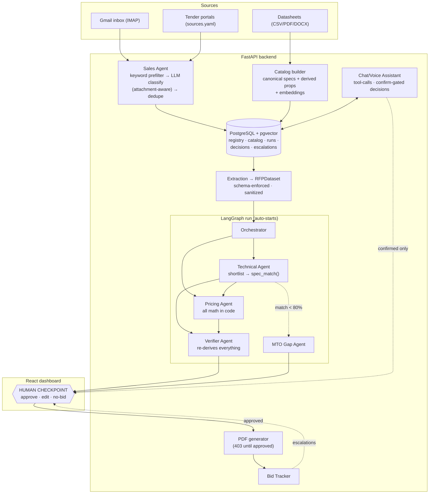

# BidPilot ⚡

**A multi-agent tender-response system for a wires & cables OEM.** It reads real tender emails from a Gmail inbox, extracts requirements from the attached documents (including PDFs embedded inside GeM bid PDFs and multi-language content), matches every line item against a live product catalog with an auditable **Spec Match %**, prices the bid from real price tables, independently **verifies its own work**, and stops at a **human checkpoint** — no agent ever submits, approves or sends anything on its own. After submission, a persistent tracker watches deadlines and replies. A built-in **chat/voice assistant** answers questions about tenders, products and prices over the live database.

> **The design rule everything follows:** LLMs do language. Code does money and law. Humans hold all authority.

`Python` `TypeScript` `FastAPI` `LangGraph` `PostgreSQL + pgvector` `React` `ReportLab` `OpenAI / Claude (provider-agnostic)`

---

## What I built

- 📬 **Live tender ingestion** — IMAP polling every 5 minutes with a zero-cost keyword prefilter before any LLM spend; LLM classification that also reads attachment contents (tender mails often have empty bodies); portal scanning with no per-site parsers (adding a portal is one line of YAML); dedupe registry with a 92-day due-date window.
- 🧾 **Schema-enforced extraction** — every LLM call goes through one gateway (`llm.py`) with server-side JSON-schema constrained output, Pydantic validation and retry-on-invalid. Handles embedded PDFs, noisy duplicated-token documents, and Hindi/regional-language tenders.
- 🎯 **Deterministic spec matching** — a pure-Python `spec_match()` scorer: equal weightage per parameter, unit normalization (11 kV = 11000 V, dual designations like 450/750), config-driven equivalence classes (Al = aluminium, IS 694/2010 = IS 694:2010, "No" = unarmoured), partial credit for numeric closeness, and hard guarantees against fuzzy false-positives (submarine ≠ submersible). Every percentage is reproducible.
- 🤖 **LangGraph agent graph** — orchestrator fans out to the Technical Agent (pgvector shortlist → deterministic scoring → top-3 per item) and Pricing Agent (test costs immediately, materials on join) in parallel; a **Verifier Agent** then independently re-derives every score and re-checks quantity × rate arithmetic, seeing only conclusions — never the other agents' reasoning. Sub-threshold items become **made-to-order drafts** instead of forced matches. Runs start automatically on ingestion.
- 🛡 **Human authority as an API constraint** — `POST /runs/{id}/decision` is the only path to any consequential action; every decision records a named actor; the bid PDF returns **403 until an approve decision exists**; follow-up emails are drafted but only sent on explicit human approval.
- 📄 **Submission-ready PDF** — formal letter-style bid document (ReportLab): cover, offered products, parameter-level compliance tables, price schedule, and a deviation statement rendered from the same evidence as the scores, so they can never disagree.
- ⏰ **Bid tracker** — scheduled deadline warnings, IMAP reply classification (award / rejection / clarification), follow-up drafting, and escalations for anything ambiguous.
- 🚨 **Fail loudly** — every agent exception, missing price, low-confidence result or dropped connection creates an escalation row on the dashboard. No silent failures, no fake data.
- 💬 **Chat & voice assistant** — tool-calling agent over the live DB (tenders, runs, catalog, escalations) with typo- and abbreviation-tolerant lookup ("hpl" → Hindustan Petroleum); browser speech-in/speech-out; the one consequential tool (record a decision) requires explicit user confirmation and a named actor.
- 📊 **Procurement-manager dashboard** — React + TypeScript: a "needs your decision" work queue with bid values and verdicts, live run progress over WebSocket, exception-first review (only flagged items expand), per-parameter comparison tables, and plain-language verdict explanations.
- ✅ **36 offline tests** — no API key, no network; the LLM is mocked at the `llm.py` boundary. Covers the scorer (incl. the exact-80% threshold edge), registry windowing (day-92 in, day-93 out), verifier behavior (wrong picks flagged — never silently corrected; trap tenders → recommend-no-bid), the 403 decision gate, and a golden fixture that pins the extraction schema.

## Architecture



## Project structure

```
BidPilot/
├── backend/                          # Python 3 · FastAPI
│   ├── app/
│   │   ├── main.py                   #   API + WebSocket + schedulers + decision gate
│   │   ├── config.py                 #   sources.yaml + .env loader (only module touching env)
│   │   ├── schemas.py                #   Pydantic models — the extraction contract
│   │   ├── llm.py                    #   single LLM gateway (structured output, retries,
│   │   │                             #   provider-agnostic: OpenAI ↔ Claude via config)
│   │   ├── assistant.py              #   chat/voice assistant (tool-calling over live DB)
│   │   ├── db.py                     #   SQLAlchemy models + pgvector
│   │   ├── ingestion/                #   email_scanner · web_scanner · docparse
│   │   ├── dataset/                  #   registry · builder (RFP extraction) · catalog
│   │   ├── matching/                 #   scorer (spec_match) · normalize · equivalence
│   │   ├── agents/                   #   graph (LangGraph) · technical · pricing ·
│   │   │                             #   verifier · mto
│   │   ├── tracking/                 #   tracker · followups · escalations
│   │   └── output/                   #   pdf (ReportLab) · deviation statement
│   ├── config/sources.yaml           #   ALL sources, keywords, thresholds, equivalences
│   ├── data/datasheets/              #   product catalog inputs (CSV/PDF)
│   ├── alembic/                      #   migrations
│   └── tests/                        #   36 offline tests + golden fixtures
├── frontend/                         # TypeScript · React · Vite
│   └── src/
│       ├── pages/                    #   Tender desk (work queue) · RunView (review) ·
│       │                             #   Bids · Alerts
│       ├── Assistant.tsx             #   chat + voice widget (Web Speech API)
│       ├── api.ts                    #   typed API client
│       └── styles.css                #   dark-theme design tokens
├── docker-compose.yml                # PostgreSQL 16 + pgvector
└── start-bidpilot.bat                # one-click startup (db + backend + dashboard)
```

## Languages & tech

| Layer | Tech |
|---|---|
| Backend | **Python** — FastAPI, LangGraph, SQLAlchemy, Pydantic, APScheduler, ReportLab, pypdf |
| Frontend | **TypeScript** — React 18, Vite, plain CSS design tokens, Web Speech API |
| Database | **PostgreSQL 16 + pgvector** (SQL via SQLAlchemy; JSONB run snapshots; vector search) |
| LLM | Provider-agnostic gateway — OpenAI (gpt-4o-mini) or Anthropic Claude, one config line to switch; OpenAI embeddings |
| Infra | Docker (database), Alembic migrations, pytest |
| Config | **YAML** — every source, keyword, threshold and equivalence class; zero hardcoded data in code |

## Running it

```bash
docker compose up -d                                   # Postgres + pgvector
cd backend && python -m venv .venv && .venv/Scripts/pip install -r requirements.txt
cp .env.example .env                                   # fill in keys (LLM, Gmail app password)
.venv/Scripts/python -m alembic upgrade head
.venv/Scripts/python -m uvicorn app.main:app --port 8000
cd ../frontend && npm install && npm run dev           # dashboard on :5173
```

Then drop datasheets into `backend/data/datasheets/`, hit **⚙ Catalog** once, and the inbox poller takes it from there. Tests: `pytest` in `backend/` — fully offline.

## License

MIT
